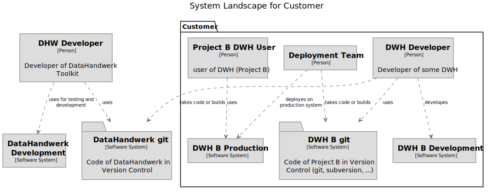
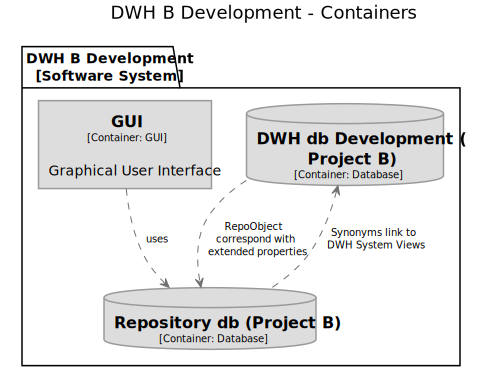
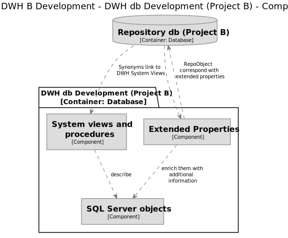
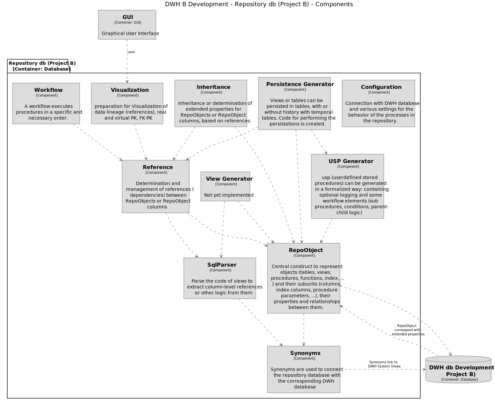
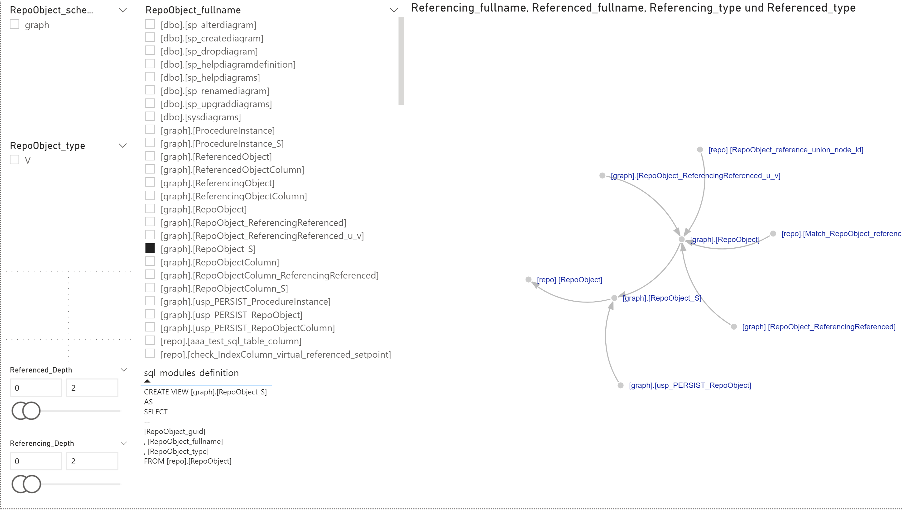

Der AnalyticsCreator (AC) hat einen vorgesehenen Kontext: die Automatisierung der Erstellung von DWH, inklusive ETL und SSAS Datenbanken. In den letzten 4 Jahren habe ich versucht, den AC für alle Arten von Datenbank-Entwicklungen zu verwenden. Dabei musste ich auf einige Features des SQL Servers verzichten, wie temporale Tabellen (die in den SQL Server eingebaute Historisierung von Daten) oder Graph-Tabellen (Node und Edge). Oft habe ich über Feature Requests angeregt, den AC in ein Instrument für die Erstellung beliebiger Datenbanken erweitern zu lassen. Viele Features wurden implementiert und ich denke, dass ich mit meinen Ideen sehr zur Vielseitigkeit des AC beigetragen habe, der ein ganz hervorragendes Produkt ist und bleibt. Gleichzeitig kann ich vom Produkt-Management nicht erwarten, dass sich der AC nur an meinen Bedürfnissen orientiert. Der AC hat zahlende Kunden mit zum Teil anderen Bedürfnissen, und die Priorisierung der Entwicklung obliegt dem AC.

**Azure Synapse Analytics** hat eine teilweise andere Syntax, als der *normale* SQL Server, und nicht einmal Microsoft selbst schafft es, eine einfache Migration vom normalen SQL Server zu Synapse zu ermöglichen. Da wäre es vermessen, so etwas von Fremdprodukten wie dem AC zu verlangen.

Statt zu hoffen, dass der AC alles unterstützt, was ich mir wünsche, und hunderte Feature Requests zu erstellen, werde ich den AC zukünftig gemäß seinem vorgesehenen Kontext verwenden und für die allgemeine Arbeit mit Datenbanken mein eigenes Toolkit. So entstand das Open-Source-Projekt [DataHandwerk-toolkit-mssql (Dokumentation)](https://datahandwerk.github.io/docs).

## Warum dieser Name und dieses Logo

in meinem Artikel ["Meine Vision eines Werkzeugkastens für Daten-Handwerker"](_posts/2021-01-06-vision-eines-werkzeugkastens-fur-daten-handwerker.md) hatte ich schon einiges zum Thema **Handwerk** geschrieben. Seit diesem Artikel arbeite ich an diesem open-source-Projekt.

>Als **Handwerk** werden zahlreiche gewerbliche Tätigkeiten bezeichnet, die Produkte meist auf Bestellung fertigen oder Dienstleistungen auf Nachfrage erbringen. Die handwerkliche Tätigkeit steht der industriellen Massenproduktion gegenüber.

Ein passendes Logo gibt es auch, denn das Deutsche Handwerkszeichen wurde 1934 vom Reichspräsidenten Paul von Hindenburg für das deutsche Handwerk gestiftet.

Im Jahrbuch des deutschen Handwerks von 1935 heißt es dazu:

>Der Hammer, der den offenen Ring schließt, bringt zum Ausdruck, wie das unfertige Material vom Handwerk zum schönen, ganzen Stück vollendet wird. Das Malkreuz auf dem Hammer deutet als altes Symbol schöpferischen Geschehens auf das Wesen deutscher Handwerksarbeit hin… Eichenblatt und Eichel, die zusammen mit dem Hammerstiel in Form der alten Hagal-Rune angeordnet sind, sollen die Einfügung des Handwerks in die völkische Lebensordnung … versinnbildlichen. Die Farben des Zeichens sind Blau in Gold, Blau ist die Farbe der Treue, Beständigkeit und Klarheit, Gold ist die Farbe der Vollendung. Durch Klarheit zur Vollendung ist der Sinn dieser Farben.

Das Handwerkszeichen war von 1934 war bis 1994 das offizielle Emblem des deutschen Handwerks, auch in der DDR, in abgewandelter Form dort auch als Symbol der Produktionsgenossenschaften des Handwerks (PGH). Es wird auch heute noch verschiedentlich benutzt. 

## Architektur des Projekts

Die [Architektur](https://datahandwerk.github.io/docs/dhw/0.1.0/arc/architecture.html) wird in der Dokumentation ausführlich auf Englisch beschrieben. Hier die Grundideen:

Statt eine fertige Datenbank vollständig (und reproduzierbar) aus einem Repository zu erstellen, wie es der AC und einige andere Tools zu Automatisierung machen, liegt bei mir der Fokus auf der selbständigen Arbeit in der Datenbank, die um ein Repository ergänzt wird.

Meine wichtigste Anforderung ist, dass man in einer Datenbank selbst entwickeln kann, mit all ihren Features, und dass das Toolkit bei Bedarf eingesetzt werden *kann*, wenn sich dadurch ein Vorteil für den Entwickler ergibt. Eine Grundidee dabei ist es, dass über **extended Properties** Metadaten mit einem **Repository** abgeglichen werden. Mit diesem Konzept können Entwicklungen in der *Datenbank* mit solchen, die im *Repository* verwaltet werden, kombiniert werden. Diese in extended Properties gespeicherten Metadaten bleiben auch mit den Datenbank-Objekten verknüpft, wenn man Objekte mit ihren extended Properties in eine andere Datenbank kopiert.

Hier einige Diagramme aus der Architekturbeschreibung:

## Stand der Entwicklung

Es gibt bereits die Komponenten

- Configuration
- RepoObject  
  - Verbindung und Synchronisation zwischen Rpeository- und DWH-Datenbank
  - virtuelle Indizies (PK, unique, normal)
- USP Generator  
  einen Generator für Prozeduren (mit Konditionen, Unter-Prozeduren, eingebautem Logging)
- Persistence Generator  
  Unterstützung zur Erstellung von Persistierungen (mit oder ohne Historisierung in temporalen Tabellen) einschließlich der dafür verwendeten Prozeduren
- Reference
  - Extraktion von Spalten-Abhängigkeiten durch Parsen des SQL Codes von Sichten
  - Ergänzung realer Objekt-Referenzen um virutelle Referenzen, beispielsweise für Persistierungen
- Inheritane  
  - Vererbung von Eigenschaften unter Verwendung von Objekt- und Spalten-Referenzen
- Logging  
  ein optionales Logging-System, aus dem heraus auch Sequenzdiagramme in PlantUML erstellt werden können

Aktuell arbeite ich an einer [Dokumentation](https://datahandwerk.github.io/docs), denn Features sind nur dann brauchbar, wenn sie auch dokumentiert werden. Die Beschreibung der Architektur ist schon ganz brauchbar. Mit dem Handbuch habe ich heute angefangen.

## GUI, Visualisierung

Eine Herausfordung ist es, eine ordentliche GUI zu erstellen, denn ich bin ein Datenbank-Entwickler, kein Anwendungs-Entwicker, und habe nicht genug Erfahrung oder Kenntnisse, eine GUI zu programmieren.

[Microsoft Access](https://www.microsoft.com/de-de/microsoft-365/access) kann sich per ODBC mit Datenbanken verbinden, ist sehr gut zur Eingabe von Daten geeignet, vor allem durch Nachschlagetabellen. Man könnte auch Formulare erstellen.

Sehr vielversprechend scheint mir [OpenXava](https://www.openxava.org/)

>Open Source Low-Code Platform for Rapid Development of Enterprise Web Applications.
>Write just the domain classes in plain Java. Get a web application ready for production.

Out-of-the-box funktioniert auch der [DBeaver](https://dbeaver.com/) schon ganz gut:
- man könnte virtuelle PK und FK definieren, die gemeinsam mit den echten PK und FK angezeigt werden
- je nachdem, wo man sich befindet, werden die passenden ER-Diagramme mit Verknüpfungen zu den Nachbarn angezeigt: https://dbeaver.com/docs/wiki/Database-Structure-Diagrams/
- Bei der Eingabe von Daten werden verknüpfte Tabellen berücksichtigt, die dann ähnlich wie Nachschlage-Tabellen funktionieren.

Zur Visualisierung von Beziehungen zwischen Objekten scheint [SchemaCrawler](https://www.schemacrawler.com/) ein mögliches Instrument. Der Entwickler ist sehr offen für sinnvolle Ergänzungen. So hatte ich nachgefragt, ob man neben echten FK (Fremsdschlüsseln) auch virtuelle Beziehungen unterstützen könnte, und das wurde prompt implementiert. Aktuell versuche ich, die Interaktive Shell das machen zu lassen, was ich will, dass sie es macht. Der Entwickler hat mir schon eine Remotsession zur Unterstützung angeboten. Wirklich super!

Über den SchemaCrawler habe ich von [DBML - Database Markup Language](https://www.dbml.org/home/) erfahren. DBML ist eine formale Sprache zur Beschreibung von Tabellen und Beziehungen zwischen ihnen. Die Vizualisierung mit [dbdiagram.io](https://dbdiagram.io/home?utm_source=dbml) ist noch nicht wirklich für große Datenbanken geeignet, und das kann ja noch werden.

Der [dbml-renderer](https://github.com/softwaretechnik-berlin/dbml-renderer) scheint geeignet, um DBML-Skripte als ER-diagramme zu visualisieren. Diese DBML-Skripte könnte man auch interaktiv aus dem DataHandwerk-Repository erstellen.

Ich habe auch getestet, [Power BI](https://powerbi.microsoft.com/de-de/) zur Visualisierung von Referenzen zu verwenden, die als Node und Edges definiert sind. Es funktioniert, ist aber auch noch nicht so, wie ich mir das vorstelle:  

Irgendwie schwebt mir schon so etwas vor, was der AnalyticsCreator bietet. Also mit einer Navigation innerhalb des Diagramms.
