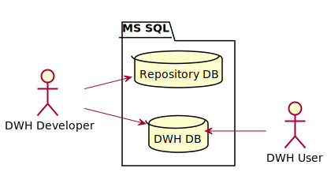
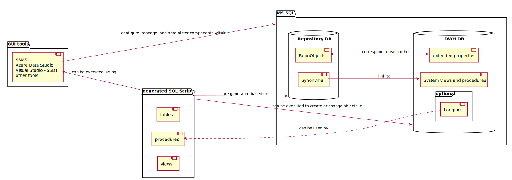

Der AnalyticsCreator (AC) hat einen vorgesehenen Kontext: die Erstellung von DWH. Sogar die Repository-Datenbanken des AC werden nicht mit dem AC verwaltet. Das ist ein deutlicher Hinweis, wofür man den AC verwenden sollte und wofür nicht. Oft habe ich über Feature Requests versucht, den AC in ein Instrument für die Erstellung beliebiger Datenbanken zu verwandeln. Viele Features wurden implementiert und ich denke, dass ich mit meinen Ideen sehr zur Vielseitigkeit des AC beigetragen habe. Gleichzeitig kann ich vom Produkt-Management nicht erwarten, dass sich der AC zu 100% an meinen Bedürfnissen orientiert. Der AC hat Kunden mit zum Teil anderen Bedürfnissen, und die Priorisierung der Entwicklung obliegt dem AC.

In den letzten 4 Jahren habe ich den AC für alle Arten von Datenbank-Entwicklungen verwendet. Dabei musste ich auf einige Features des SQL Servers verzichten, wie temporale Tabellen (die in den SQL Server eingebaute Historisierung von Daten) oder Graph-Tabellen (Node und Edge). **Azure Synapse Analytics** hat eine teilweise andere Syntax, als der *normale* SQL Server, und nicht einmal Microsoft selbst schafft es, eine einfache Migration vom normalen SQL Server zu Synapse zu ermöglichen. Da wäre es vermessen, so etwas von Fremdprodukten wie dem AC zu verlangen.

Statt mich zu ärgern, dass der AC nicht alles unterstützt, was ich mir wünsche, werde ich den AC zukünftig gemäß seinem vorgesehenen Kontext verwenden und mir für die allgemeine Arbeit mit Datenbanken mein eigenes Toolkit erstellen. So entstand das Open-Source-Projekt [DataHandwerk-toolkit-mssql](https://github.com/DataHandwerk/DataHandwerk-toolkit-mssql).

Eine wichtige Anforderung ist es, dass man in der Datenbank selbst entwickeln kann, mit all ihren Features, und dass das Toolkit bei Bedarf eingesetzt werden *kann*, wenn sich dadurch ein Vorteil für den Entwickler ergibt. Eine Grundidee dabei ist es, dass über **extended Properties** Metadaten mit dem Repository abgeglichen werden. Mit diesem Konzept können Entwicklungen in der Datenbank mit solchen, die vom Repository verwaltet werden, kombiniert werden. Diese Metadaten bleiben auch mit den Datenbank-Objekten verknüpft, wenn man Objekte mit ihren extended Properties in eine andere Datenbank kopiert.

Das unfertige Architektur-Dokument auf Englisch gibt es hier: [dhw-arc42](https://raw.githack.com/DataHandwerk/DataHandwerk-toolkit-mssql/main/docs/build/html5/dhw-arc42.html)

### Business Kontext

### Technischer Kontext

Es gibt bereits

- ein optionales Logging-System, aus dem heraus auch Sequenzdiagramme in PlantUML erstellt werden können
- Unterstützung zur Erstellung von Persistierungen (mit oder ohne Historisierung in temporalen Tabellen) einschließlich der dafür verwendeten Prozeduren
- einen Generator für Prozeduren (mit Konditionen, Unter-Prozeduren, eingebautem Logging)
- die Extraktion von Spalten-Abhängigkeiten durch Parsen des SQL Codes von Sichten
- Die Ablage und Verwendung von Abhängigkeiten zwischen Objekten, Spalten, Prozeduraufrufen unter Verwendung von Graph-Tabellen

Noch ist das Projekt nicht ausreichend dokumentiert und somit noch nicht wirklich für andere Anwender geeignet.
