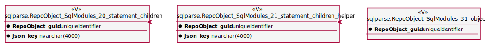
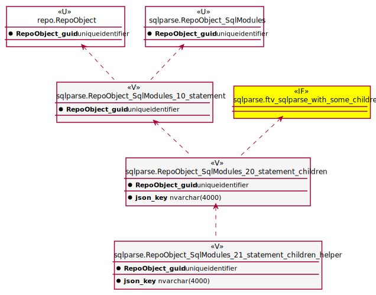
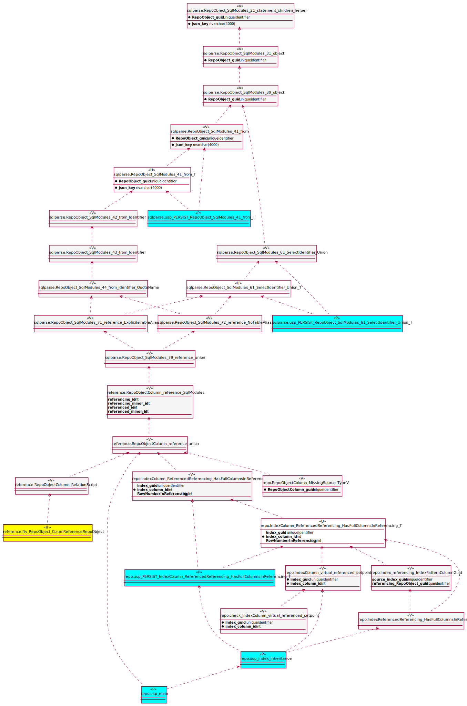
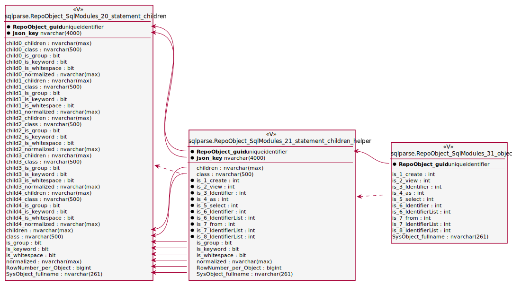

Mit meinem open-Source-Projekt [DataHandwerk-toolkit-mssql](https://datahandwerk.github.io) möchte ich auch Erfahrungen zur Dokumentation zukünftiger Projekte sammeln. Warum habe ich mich für die Auszeichnungssprache [AsciiDoc](https://asciidoc.org) statt für Markdown, und warum für das Dokumentations-Framework [Antora](https://antora.org/) entschieden? Wie wurden Diagramme in der [Architektur-Beschreibung](https://datahandwerk.github.io/dhw/0.1.0/arc/architecture.html) erstellt? Und wie erfolgt die Darstellung von Objekt- und Spalten-Referenzen?

### Auszeichungssprache Markdown?

Sehr oft erfolgt die Dokumentation unter Verwendung der Auszeichungssprache [Markdown](https://www.markdownguide.org/), [Markdown Wikipedia](https://de.wikipedia.org/wiki/Markdown)

- in den mir bekannten Wiki-Systemen wird mit Markdown gearbeitet (manchmal auch zusätzlich mit weiteren Auszeichungssprachen)
- Es gibt viel und gute Software-Unterstützung für Markdown
  - Am PC verwende ich [Visual Studio Code](https://code.visualstudio.com/) zum Editieren und zur Vorschau von Markdown. Und es gibt genügend andere Möglichkeiten, mit Markdown zu arbeiten
  - Auf Android verwende ich [Markor](https://gsantner.net/project/markor.html), gelegentlich auch [Epsilon Notes](http://epsilonexpert.com/e/index.php?i=1)
- Diese Website hier wird mit dem Generator für statische Seiten [Jekyll](https://jekyllrb.com/) erstellt und seine Inhalte sind in Markdown geschrieben
- Meine Notizen schreibe ich in Markdown, womit auch ein sehr einfacher Austausch zwischen Smartphone und PC möglich ist. Die Notizen können auch mit jedem beliebigen Plain-Text-Editor gelesen und bearbeitet werden. Ich werde nicht zum Sklaven einer Notiz-Software.
- Zur technischen Projektbeschreibung in Markdown gibt ein gutes open-source-Projekt: [mkdocs.org](https://www.mkdocs.org/). Darauf basierend gibt es [Material for MkDocs](https://squidfunk.github.io/mkdocs-material/)

Doch Markdown hat auch entscheidende Schwächen:

- alles muss in einem Dokument enthalten sein, es gibt kein "include", um Blöcke oder Inhalte aus anderen Dateien einzubinden
- es gibt nicht "das eine Markdown", sondern Dutzende verschiedene Dialekte, wobei diese Dialekte teilweise auf unterschiedliche Art und Weise versuchen, Markdown um fehlende Funktionen zu ersetzen.  
  Hier kann man testen, wie Markdown von verschiedenen Dialekten unterschiedlich in HTML konvertiert wird: [Test mit johnmacfarlane.net](https://johnmacfarlane.net/babelmark2/?normalize=1&text=*+A%0A+*+B%0A++*+C%0A+++*+D%0A++++*+E%0A+++++*+F%0A++++++*+G)
- einen automatischen eingebauten TOC (Table of Content, Inhaltsverzeichnis) gibt es nicht, dieser muss separat erstellt werden (doch dafür gibt es Tools)

### Auszeichnungssprache AsciiDoc!

Die GitHub Wiki hat Markdown Support, will oder kann aber nicht einen automatischen TOC erstellen. Doch GitHub Wiki und readme Dateien unterstützen nicht nur Markdown, sondern auch [AsciiDoc](https://asciidoc.org). Und AsciiDoc kann den TOC "out of the box" erstellen. So fand ich zu AsciiDoc.

Und ich bin begeistert von den Möglichkeiten, die AsciiDoc im Vergleich zu Markdown bietet, wenn es darum geht, eine gut formatierte Dokumentation zu erstellen. Besonders wertvoll ist die Möglichkeit, auch Inhalte aus anderen Dokumenten als "**includes**" einzubinden. **Variablen** können verwendet werden. Es gibt **_eine_** Syntax, und nicht dutzende Dialekte. Dabei ist die Syntax ähnlich einfach, wie die von Markdown:

[AsciiDoc Syntax Quick Reference](https://docs.asciidoctor.org/asciidoc/latest/syntax-quick-reference/)

Allerdings werde ich für normale Notizen vorerst weiter Markdown verwenden müssen, wenn ich sowohl auf Android als auch am Rechner an diesen Dokumenten arbeiten will. Denn mein Android-Editor **Markor** hat leider noch keine AsciiDoc-Unterstützung implementiert: [Add format: AsciiDoc (Highlighter, TextActions)](https://github.com/gsantner/markor/issues/808)  
Und ich habe auch noch keinen anderen Android-AsciiDoc-Editor gefunden.

**Update:** obwohl es immer noch keinen Android Editor mit AsciiDoc Unterstützung gibt, habe ich mein Notizen-System von Markdown auf AsciiDoc umgestellt. Die Notizen befinden sich in einem privaten Repository auf Gitlab, es gibt für Android einen Git-Client [MGit](
https://github.com/maks/Mgit), als Editor verwende ich weiter Markor und der Preview erfolgt über einen lokalen Webserver (NiM Webserver), die Anzeige mit der AsciiDoc Preview Extension für Chrome Desktop. Da man im Chrome Android keine Erweiterungen installieren kann, verwende ich dafür den Kiwi-Browser. Auch einige andere Browser ermöglichen die Verwendung von Erweiterungen (Yandex,...). Das scheint etwas kompliziert, muss aber nur einmal eingerichtet werden. Und AsciiDoc ist auch ohne Preview gut lesbar.

### 'Docs-as-Code' und 'Code-as-Docs'

Über AsciiDoc fand ich das Konzept "Docs-as-Code".

- [docs-as-co.de](https://docs-as-co.de/)
- [Docs-as-Code – Die Grundlagen](https://www.informatik-aktuell.de/entwicklung/methoden/docs-as-code-die-grundlagen.html)
- [Docs as Code](https://www.writethedocs.org/guide/docs-as-code/)

**Docs-as-Code** und **AsciiDoc** passen auch sehr gut zu meiner langjährigen Begeisterung für das, was ich **Code-as-Docs** nenne: die Dokumentation direkt aus dem Code oder unter Verwendung des Codes zu erstellen. Denn mit AsciiDoc kann man den Inhalt anderer Dokumente einbeziehen. Diese Inhalte können somit im Code (beispielsweise in Kommentaren) vorbereitet werden.

Ein Beispiel sieht man auf dieser Seite meiner DataHandwerk-Projekt-Dokumentation: [Create, update and connect repository database](https://datahandwerk.github.io/dhw/0.1.0/manual/create-update-connect-repo-db.html)  
Hier werden

- Text-Inhalte anderer Dokumente _eingebunden_ und manchmal _zitiert_
- die ~~gleichen~~ selben (!) in PlantUML definierten Diagramme verwendet, wie auch in den Architektur-Dokumenten
- Am Ende des Dokuments wird der SQL Code einer Prozedur eingebunden. Wenn sich der Code ändert, kommen diese Änderungen auch in der Dokumentation an.
- Eigenschaften wie eine Beschreibung oder ein Anwendungs-Beispiel der Prozedur können im Kommentar einer Prozedur definiert werden, um dann auf der Dokumenations-Seite der Prozedur zu erscheinen:  
  [config.usp_connect_database](https://datahandwerk.github.io/dhw/0.1.0/sqldb/config.usp_connect_database.html)

```sql
/*
<<property_start>>MS_Description
* connect repo datatabase to dwh database using synonyms executing
* see details in xref:manual:create-update-connect-repo-db.adoc[]
<<property_end>>

<<property_start>>exampleUsage
EXEC [config].[usp_connect_database]
@dwh_database_name = 'WideWorldImporters'
<<property_end>>
*/
CREATE Procedure [config].[usp_connect_database]
( @dwh_database_name NVarchar(128))
As
Begin
    --
    --ensure existence of required parameters like 'dwh_database_name'
    Exec config.usp_init_parameter;
...
```

### docToolchain

[doctoolchain.github.io/docToolchain](https://doctoolchain.github.io/docToolchain/)

>docToolchain is an implementation of the docs-as-code approach for software architecture plus some additional automation. The basis of docToolchain is the philosophy that software documentation should be treated in the same way as code together with the arc42 template for software architecture.

Ich war begeistert, wie schnell sich docToolchain nicht nur installieren ließ, sondern dass auch sofort alles auf Anhieb funktionierte. Ein Kommando im Terminal, und kurz darauf war alles in schönstem HTML5 gerendert: Die Inhalte eingesammelt aus verschiedenen Dateien, Diagramme in PlantUML definiert. Man kann sogar Excel verwenden, um auch etwas kompliziertere Tabellen in Excel zu erstellen und für AsciiDoc zu exportieren (zur weiteren Verarbeitung durch AsciiDoc).

Einfach ist es auch, basierend auf dem Template [github.com/docToolchain/arc42-template-project](https://github.com/docToolchain/arc42-template-project) auf Knopfdruck eine fertige Mico-Site zu erstellen: [arc42-demo.netlify.app](https://arc42-demo.netlify.app/) Diese Idee gefiel mir so gut, dass ich ursprünglich damit auch meine Projekt- und Datenbank-Dokumentation erstellen wollte. Im Beispiel sieht das auch alles sehr schön aus, in der Praxis ist aber der TOC auf der linken Seite fest eingebaut und hat keine vertikale Scrollbar. So dass damit Inhalte am unteren Rand abgeschnitten werden und nicht erreichbar sind:  


Leider habe ich nicht gefunden, wie man das im CSS (oder wo auch immer) ändern könnte oder müsste. Und irgendwann habe ich aufgegeben:  
[toc is static without scrollbars. long toc are hard to use. very different view in preview and on the website](https://github.com/docToolchain/arc42-template-project/issues/7)  
Mit ein wenig mehr Energie lässt sich das vielleicht lösen.

**Update:** Inzwischen wird ein anderes Standard-Thema verwendet und das Problem wurde dadurch gelöst.

### arc42

doctoolchain ist mit den Leuten von [arc42](https://arc42.org/) verbandelt.

>arc42 enthält ein erprobtes und pragmatisches Template zur Entwicklung, Dokumentation und Kommunikation von Softwarearchitekturen. Tausende zufriedene Nutzer weltweit.

Also habe ich mir das angeschaut und für gut befunden. Das DataHandwerk-Architektur-Dokument basiert auf diesem Template: [Architecture](https://datahandwerk.github.io/dhw/0.1.0/arc/architecture.html)

### Structurizr DSL und das C4 Modell für die Visualizierung von Software-Architektur

Meine ersten Architektur-Diagramme erstellte ich noch manuell und individuell mit [PlantUML](https://plantuml.com/). Dann fand ich [Structurizr](https://structurizr.com/) und [github.com/structurizr/cli](https://github.com/structurizr/cli), um Software Architektur Diagramme formalisierter zu erstellen. Die Definition erfolgt in _einem_ Skript in einer eigenen und einfachen Skript-Sprache [Structurizr DSL](https://github.com/structurizr/dsl/blob/master/docs/language-reference.md), und aus diesem _einen_ Skript können verschiedene **in sich konsistente Diagramme** erstellt werden. Man ändert beispielsweise Beschreibungen oder Beziehungen im Skript und alle Teil-Diagramme übernehmen diese Änderungen.

Beispiele finden sich in der DataHandwerk-Architektur-Dokumentation: [03 System Scope and Context](https://datahandwerk.github.io/dhw/0.1.0/arc/architecture.html#section-system-scope-and-context)  
Definition meiner Architektur-Diagramme in "Structurizr DSL": [dhw.dsl](https://github.com/DataHandwerk/DataHandwerk-docs/blob/main/docs/modules/arc/partials/c4_dsl/dhw.dsl)

### Antora

Nachdem ich es mit docToolchain nicht geschafft hatte, eine Website zur Projekt- und Datenbank-Dokumentation mit einem TOC zu erstellen, der meinen Vorstellungen entsprach, schaute ich mir [Antora](https://antora.org/) an, da dieses Werkzeug von den gleichen Entwicklern erstellt und gepflegt wird, die auch Asciidoctor entwickeln. Folgende Dokumentationen werden ebenfalls mit Antora erstellt und sie bieten das, was ich mir unter einer guten Dokumentation vorstelle. Und sie basieren ausschließlich auf meinem neuen Liebling AsciiDoc

* [Antora Documentation](https://docs.antora.org/)
* [Asciidoctor Documentation Home](https://docs.asciidoctor.org/)

Allerdings ist der Einstieg in Antora nicht ganz so einfach, wie der in doctoolchain: Die Quellen der Dokumentation müssen in einer bestimmten Struktur vorliegen und es werden nur Inhalte aus dieser Struktur verwendet. Ein großer Vorteil ist allerdings, dass git-Repositories als Quellen verwendet werden und dass man mehrere Repositories gleichzeitig als Quellen verwenden und in einer einheitlichen Dokumentation kombinieren kann.

Ein wichtiges Konzept sind dabei "virtuelle Datei Objekte": Antora sammelt die Daten aus verschiedenen Quell-Repositories ein und verwendet so etwas wie ein internes zusammengesammeltes Repository, wobei für die Referenzen zwischen Inhalten [Page IDs und Cross References](https://docs.antora.org/antora/2.3/page/page-id/) verwendet werden. Die Verwendung dieser Referenzen ist zum einen die Grundidee von Antora, und sie stellt gleichzeitig eine Einbahnstraße dar, weil diese Referenzen außerhalb Antoras nicht mehr funktionieren.

[How Antora Works](https://docs.antora.org/antora/2.3/how-antora-works/)

Im DataHandwerk-Projekt beschreibe ich, wie man aus der Repository-Datenbank automatisch generierte Datenbank-Dokumentationen erstellen kann, die final von Antora gerendert werden: [Database documentation generator](https://datahandwerk.github.io/dhw/0.1.0/manual/documentation-generator.html).

Ich hatte auch versucht, das Datenbank-Projekt mit seinem Code für alle Objekte direkt in Antora einzubinden. Mit doctoolchain wäre das recht einfach gewesen. Für Antora mussten dazu die Inhalte das Datenbank-Projekts in ein separates Repository kopiert werden, damit die Inhalte in der von Antora benötigten Form vorliegen. Das funktionierte, allerdings habe ich diese Idee verworfen und exportiere alle Inhalte für die Datenbank-Dokumentation direkt aus der Repository-Datenbank.

Auch das Ergebnis der DataHandwerk-Datenbank-Dokumentation kann man sich anschauen.  Beispielsweise [docs.RepoObject_Adoc](https://datahandwerk.github.io/dhw/0.1.0/sqldb/docs.RepoObject_Adoc.html)

* eine Seite pro Datenbank-Objekt
* Dokumentation realer und **virtueller** Primary Keys
* Dokumentation von Objekt-Referenzen und auch von **Zeilen-Referenzen**
* **Visualisierung** von Referenzen und realen und virtuellen Foreign Keys als [PlantUML](https://plantuml.com/)-Diagramme

### PlantUML

Die Visualisierungen erstelle ich direkt aus dem SQL Server heraus für jedes Objekt als [PlantUML](https://plantuml.com/) Diagramme. Diese Diagramme werden vom Asciidoctor bzw. einer entsprechenden Erweiterung gerendert. Pro Datenbank-Objekt erstelle ich derzeit 5 Diagramme

- **Objekt-Referenzen** mit jeweils einem Level der Vorgänger und einem Level der Nachfolger
- **Zeilen-Referenzen** mit jeweils einem Level der Vorgänger und einem Level der Nachfolger
- Objekt-Referenzen mit Vorgängern _aller_ Level
- Objekt-Referenzen mit Nachfolgern _aller_ Level
- Beziehungen zwischen realen und virtuellen Fremdschlüsseln (nur für Tabellen und Sichten)

Quelle für die Diagramme ist die DataHandwerk-Repository-Datenbank, welche auch die Definition virtueller Indizes, virtueller PK und die Ermittlung von Spalten-Referenzen unter Verwendung von [sqlparse](https://pypi.org/project/sqlparse/) beinhaltet. Hier ein paar Beispiele für die Sicht [sqlparse.RepoObject_SqlModules_21_statement_children_helper](https://datahandwerk.github.io/dhw/0.1.0/sqldb/sqlparse.RepoObject_SqlModules_21_statement_children_helper.html)

#### Object Reference Diagram



#### Object Reference Diagram - Referenced



#### Object Reference Diagram - Referencing



#### Column Reference Diagram


